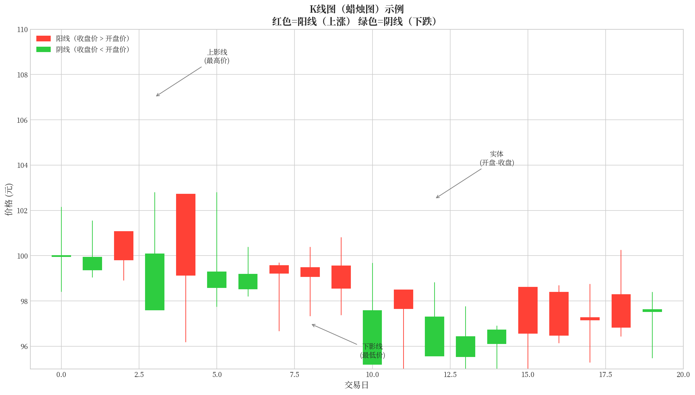
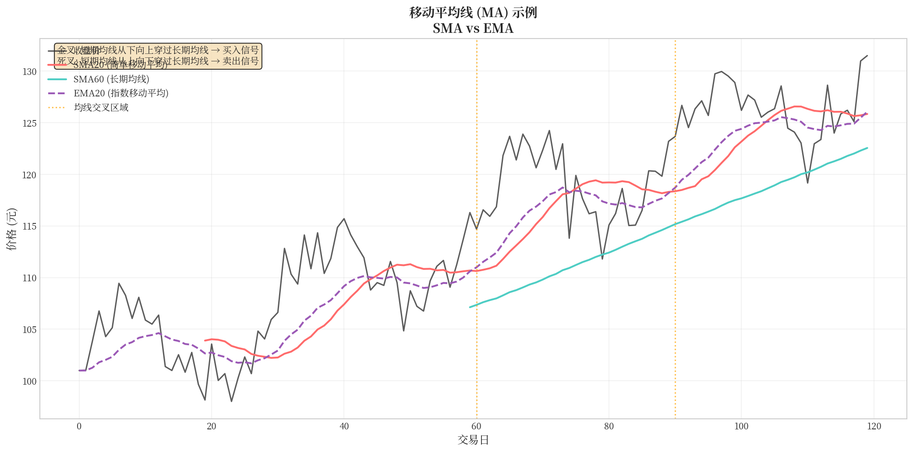
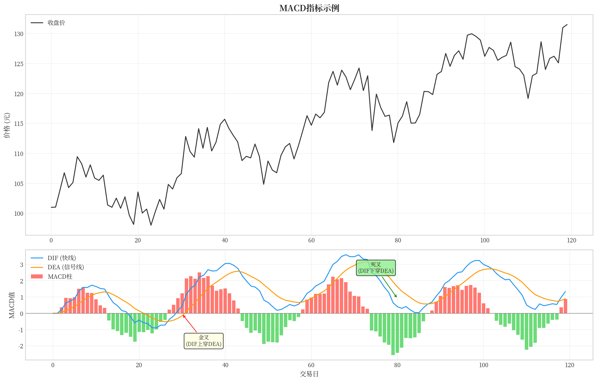
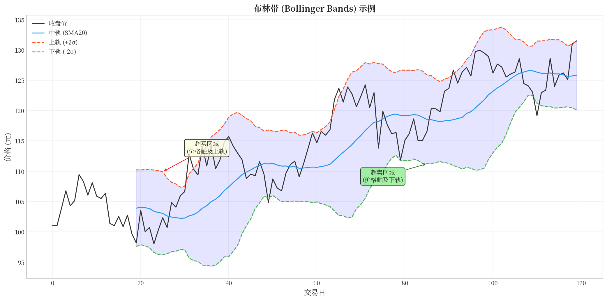
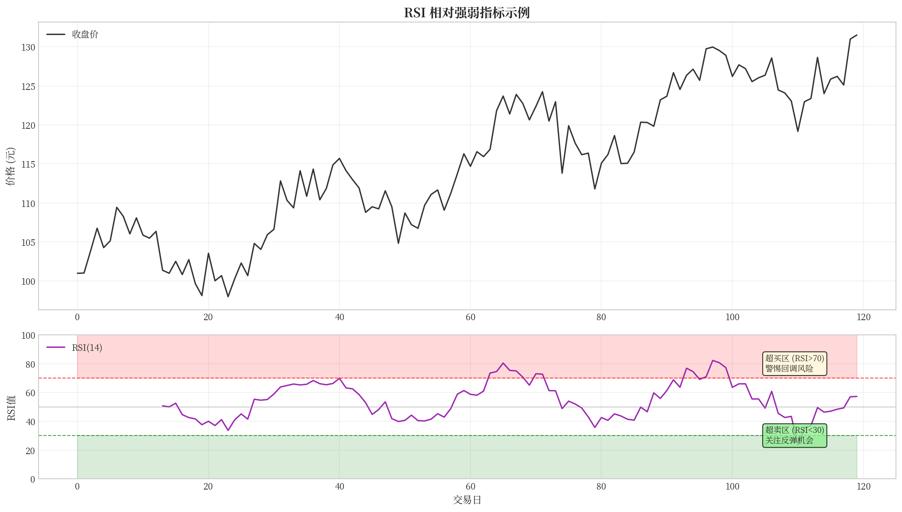
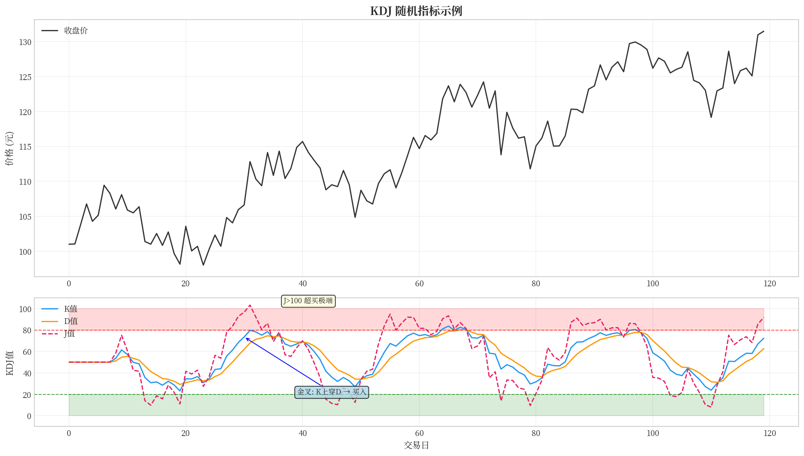
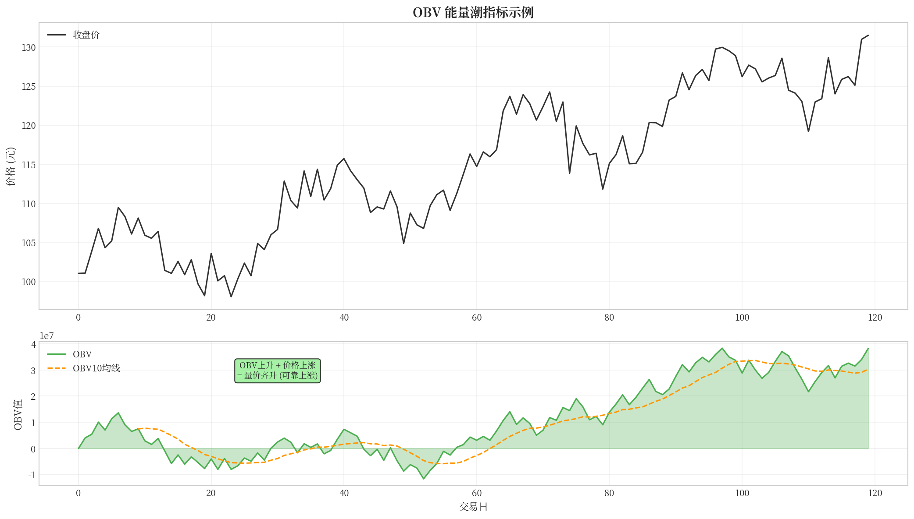
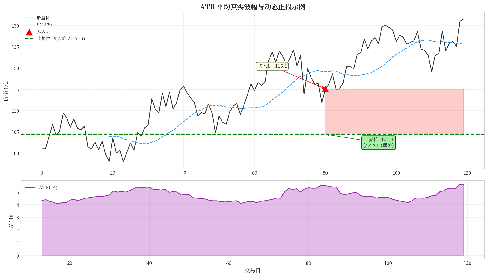
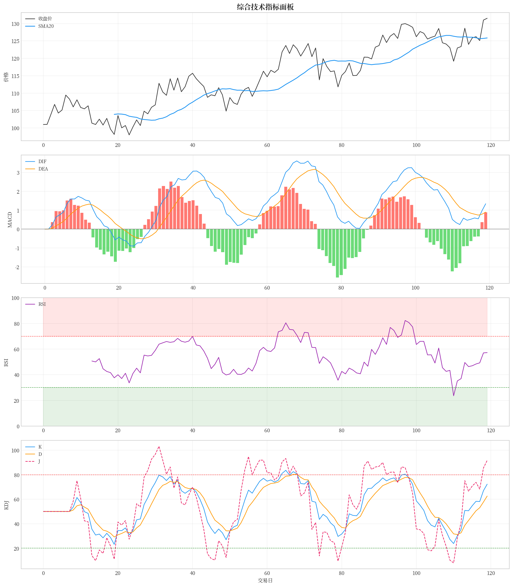

# 金融市场技术指标完全指南

## 从零开始理解量化交易的必备知识

---

## 前言：什么是技术分析？

在进入具体的指标介绍之前，我们首先要理解一个根本性的问题：**技术分析到底是什么？**

### 技术分析的核心思想

技术分析是一种通过研究**历史价格和成交量数据**来预测未来价格走势的方法。它的核心假设是：**市场行为会重复发生**，即过去出现的某些价格模式在未来可能会再次出现。

这就像是我们观察大海的潮汐规律。虽然每次潮汐的具体高度可能不完全相同，但我们可以通过观察历史数据来把握整体规律——什么时候涨潮、什么时候退潮。技术指标就是帮助我们识别这些"潮汐规律"的工具。

### 为什么需要技术指标？

如果我们只是单纯地看价格走势图，很难从中提取出有用的信息。价格每天都在波动，这些波动哪些是"噪音"，哪些是真正的"信号"？技术指标的作用就是**把复杂的原始数据转换成更容易理解的数值**，帮助我们做出更理性的投资决策。

举一个生活中的例子：假设我们要判断一天的气温变化趋势，仅仅看每一时刻的温度数字是很杂乱的。但是如果我们把这些温度数据画成曲线，再加上"移动平均线"，就能更清楚地看到整体是升温还是降温的趋势。技术指标的作用与之类似。

---

## 第一章：看懂K线——一切技术分析的基础

在学习具体的技术指标之前，我们首先要学会看**K线图**。K线是技术分析中最基础的数据单位，几乎所有的技术指标都是基于K线数据计算得出的。

### 什么是K线？

K线（也称为蜡烛图）是一种用来记录价格变动的图形。每根K线包含四个关键价格信息：

| 组成部分 | 含义 |
|---------|------|
| **开盘价** | 当日开始交易时的第一笔成交价格 |
| **收盘价** | 当日结束交易时的最后一笔成交价格 |
| **最高价** | 当日交易的最高成交价格 |
| **最低价** | 当日交易的最低成交价格 |

这四个价格通常简称为**OHLC**：Open（开盘）、High（最高）、Low（最低）、Close（收盘）。

#### 图示说明



*上图展示了K线的基本结构：红色为阳线（上涨），绿色为阴线（下跌）。每根K线包含开盘价、收盘价、最高价、最低价四个信息。*

- **阳线**（红色或空心）：收盘价高于开盘价，表示价格上涨
- **阴线**（绿色或实心）：收盘价低于开盘价，表示价格下跌

### K线形态的市场含义

除了简单的涨跌判断，K线的**实体大小**和**影线长度**也传递着重要的市场信息。

#### 按实体大小分类

| 形态 | 特征 | 市场含义 |
|------|------|---------|
| **大阳线** | 实体较长，涨幅较大 | 多方力量强劲，买方占优，后市看涨 |
| **大阴线** | 实体较长，跌幅较大 | 空方力量强劲，卖方占优，后市看跌 |
| **小阳线** | 实体较短，涨幅较小 | 多方力量有限，上涨乏力，可能进入调整 |
| **小阴线** | 实体较短，跌幅较小 | 空方力量有限，下跌乏力，可能进入调整 |
| **十字星** | 开盘价等于收盘价 | 多空力量平衡，市场处于观望或可能反转 |

#### 按影线分类

| 形态 | 特征 | 市场含义 |
|------|------|---------|
| **长上影线** | 上影线很长，实体在下部 | 买方试图上涨但被卖方打回，上涨受阻，可能见顶 |
| **长下影线** | 下影线很长，实体在上部 | 卖方试图下跌但被买方托住，下跌受支撑，可能见底 |
| **光头阳线** | 无上影线，实体在下部 | 当日最低价开盘后持续上涨，多方强劲 |
| **光脚阴线** | 无下影线，实体在上部 | 最高价开盘后持续下跌，空方强劲 |
| **光头光脚** | 无影线，实体完整 | 趋势强劲，无任何抵抗 |

#### 经典K线组合形态

1. **早晨之星（买入信号）**
   - 由三根K线组成：先是下跌趋势中的一根大阴线，然后是一根十字星，最后是一根大阳线
   - 意味着空方力量耗尽，多方开始反击

2. **黄昏之星（卖出信号）**
   - 由三根K线组成：先是一根大阳线，然后是一根十字星，最后是一根大阴线
   - 意味着多方力量耗尽，空方开始反击

3. **吞没形态**
   - **看涨吞没**：阴线被后续的阳线完全吞没，多方反扑
   - **看跌吞没**：阳线被后续的阴线完全吞没，空方反扑

> **小贴士**：单一K线只是市场的一个瞬间快照，需要结合前后K线和整体趋势来判断。学习K线形态的目的是培养"市场感觉"，但不要过度依赖单一信号。

### K线周期

K线可以按照不同的时间周期来绘制：

- **分钟K线**：1分钟、5分钟、15分钟、30分钟、60分钟
- **日K线**：每个交易日形成一根K线
- **周K线**：每周形成一根K线
- **月K线**：每月形成一根K线

不同周期的K线服务于不同的分析目的：短线交易者通常看分钟K线和日K线，而长线投资者则更关注周K线和月K线。

> **重要提示**：技术指标的计算都是基于OHLC这四个价格数据。无论你使用什么技术指标，首先要确保你理解了这四个基本数据的含义。

---

## 第二章：趋势类指标——判断市场方向

**趋势类指标**是技术分析中最基础也是最重要的一类指标。它们的核心作用是帮助我们判断市场当前是处于上涨趋势、下跌趋势，还是震荡整理状态。

### 2.1 移动平均线（MA/SMA）

#### 什么是移动平均线？

移动平均线是最基本也是应用最广泛的技术指标之一。它的计算方法非常简单：**将过去一定数量的收盘价相加，然后除以天数**。

举个例子，如果你想计算5日简单移动平均线（SMA5），就需要把过去5天的收盘价加起来，然后除以5。

#### 计算公式

**简单移动平均线（SMA）的计算公式：**

```
SMA(n) = (C1 + C2 + ... + Cn) / n
```

其中：
- C1, C2, ..., Cn 表示过去 n 天的收盘价
- n 表示计算的天数

**举例说明：**

假设过去5天的收盘价分别为：10元、11元、12元、11.5元、12.5元

```
SMA5 = (10 + 11 + 12 + 11.5 + 12.5) / 5 = 57 / 5 = 11.4元
```

#### 均线的基本应用

1. **判断趋势方向**：
   - 当价格站在均线之上，且均线向上倾斜 → **上升趋势**
   - 当价格位于均线之下，且均线向下倾斜 → **下降趋势**

2. **均线交叉信号**：
   - **金叉**：短期均线从下向上穿过长期均线 → **买入信号**
   - **死叉**：短期均线从上向下穿过长期均线 → **卖出信号**

3. **均线排列**：
   - 多头排列（短期 > 中期 > 长期均线）→ **强势上涨**
   - 空头排列（短期 < 中期 < 长期均线）→ **强势下跌**

#### 图示说明



*上图展示了不同周期的移动平均线：SMA20（红色）为20日简单均线，EMA20（紫色虚线）为20日指数均线。短期均线上穿长期均线形成"金叉"是买入信号。*

---

### 2.2 指数移动平均线（EMA）

#### 什么是EMA？

**EMA（Exponential Moving Average）** 是指数移动平均线，它与SMA的区别在于：**EMA对近期价格赋予更大的权重**，因此EMA对价格变化的反应更加灵敏。

可以这样理解：SMA就像是一个人的历史平均成绩，不管最近考了多少分，都和以前的成绩一视同仁；而EMA更像是老师根据最近几次考试来评估你的当前水平，最近的考试权重更高。

#### 计算公式

```
EMA(n) = α × 当日收盘价 + (1 - α) × 前一日EMA值
```

其中：
- α = 2 / (n + 1)，称为平滑系数
- n 是计算周期

**计算示例：**

假设要计算12日EMA（EMA12），α = 2/(12+1) ≈ 0.154

- 第一天EMA = 当日收盘价（初始化）
- 第二天EMA = 0.154 × 第二天收盘价 + 0.846 × 第一天EMA
- 以此类推...

#### SMA vs EMA：有什么区别？

| 特性 | SMA（简单移动平均） | EMA（指数移动平均） |
|-----|-------------------|-------------------|
| 计算方式 | 简单算术平均 | 加权平均，近期权重更大 |
| 反应速度 | 较慢，容易滞后 | 较快，反应灵敏 |
| 适用场景 | 长期趋势判断 | 短期交易信号 |

**实战建议**：
- **MACD**中的DIF线默认使用EMA（12日和26日）
- 短线交易者更喜欢用EMA来捕捉快速变化
- 长线投资者常用SMA来过滤短期波动噪音

---

### 2.3 MACD指标

#### 什么是MACD？

**MACD（Moving Average Convergence Divergence）**，中文译为"移动平均收敛发散指标"，是由美国分析师杰拉尔德·阿佩尔（Gerald Appel）在1970年代创建的。它是技术分析中最受欢迎的趋势动量指标之一。

MACD的核心思想是：通过比较**短期EMA**和**长期EMA**的差异，来判断价格趋势的变化。

#### MACD的组成

MACD指标由三部分组成：

```
┌─────────────────────────────────────────────────┐
│                   MACD 指标结构                   │
├─────────────────────────────────────────────────┤
│                                                 │
│   DIF线（差离值）= EMA(12日) - EMA(26日)         │
│                                                 │
│   DEA线（信号线）= DIF的9日EMA                   │
│                                                 │
│   MACD柱 = 2 × (DIF - DEA)                     │
│                                                 │
└─────────────────────────────────────────────────┘
```

#### 计算过程

**第一步：计算DIF线（快线）**

```
DIF = EMA(12日收盘价) - EMA(26日收盘价)
```

- EMA12：对近期价格更敏感的快速均线
- EMA26：对价格反应较慢的慢速均线
- DIF = 两者之差，反映短期趋势与长期趋势的距离

**第二步：计算DEA线（信号线）**

```
DEA = EMA(DIF, 9)
```

对DIF进行9日平滑处理，得到信号线。

**第三步：计算MACD柱**

```
MACD柱 = 2 × (DIF - DEA)
```

MACD柱是用来显示DIF和DEA之间差距的图形，当DIF > DEA时为红柱（多头），当DIF < DEA时为绿柱（空头）。

#### MACD的基本应用

1. **金叉与死叉**：
   - **金叉**：DIF从下向上穿过DEA → **买入信号**
   - **死叉**：DIF从上向下穿过DEA → **卖出信号**

2. **零轴判断**：
   - DIF和DEA都在零轴上方 → **多头市场**（上涨趋势）
   - DIF和DEA都在零轴下方 → **空头市场**（下跌趋势）

3. **背离现象**：
   - **顶背离**：价格创新高，但MACD没有创新高 → **预警：可能下跌**
   - **底背离**：价格创新低，但MACD没有创新低 → **预警：可能上涨**

#### 图示说明



*上图展示了MACD指标的三个组成部分：DIF线（蓝色）、DEA信号线（橙色）和MACD柱状图。金叉（蓝线上穿橙线）是买入信号，死叉是卖出信号。*

---

### 2.4 布林带（Bollinger Bands）

#### 什么是布林带？

**布林带**是由约翰·布林格（John Bollinger）在1980年代创建的技术指标。它由三条线组成：中轨（移动平均线）和上下两条轨道线。

布林带的核心思想是：**价格在大部分时间内会在"带状"范围内波动**，当价格触及上轨或下轨时，可能意味着价格即将发生反转。

#### 计算公式

```
中轨（MB）= SMA(n)
上轨（UP）= MB + K × σ
下轨（DN）= MB - K × σ
```

其中：
- n 通常取 20（日）
- K 通常取 2（标准差倍数）
- σ 是标准差

**标准差**小知识：标准差是统计学中衡量数据波动程度的指标。简单来说，它告诉我们数据分散的程度有多大。在布林带中，K=2意味着大约95%的价格数据会落在上下轨之间。

#### 布林带的基本应用

1. **判断超买超卖**：
   - 价格触及上轨 → **超买**，可能面临回调压力
   - 价格触及下轨 → **超卖**，可能迎来反弹机会

2. **判断波动性**：
   - 布林带开口放大 → 市场波动性增加
   - 布林带收口变窄 → 市场可能即将突破

3. **判断趋势**：
   - 价格沿着上轨持续上涨 → **强势上涨趋势**
   - 价格沿着下轨持续下跌 → **强势下跌趋势**

#### 图示说明



*上图展示了布林带的三条线：中轨（蓝色）为20日简单均线，上轨（红色虚线）和下轨（绿色虚线）分别是中轨加减2倍标准差。布林带像一条价格通道，当价格触及上轨时可能超买触及下轨时可能超卖。*

---

### 2.5 ADX指标

#### 什么是ADX？

**ADX（Average Directional Index）** 是平均趋向指数，它用于衡量**趋势的强度**，但不判断趋势的方向。ADX是由J. Welles Wilder Jr.在1978年提出的。

通俗地说，ADX告诉我们市场是处于**有趋势**（强趋势）还是**无趋势**（震荡整理）的状态。

#### 计算公式

ADX的计算相对复杂，需要先计算以下三个值：

**第一步：计算方向性运动**

```
+DM（正向运动）= 今日最高价 - 昨日最高价
-DM（负向运动）= 昨日最低价 - 今日最低价
```

**第二步：计算真实波幅（TR）**

```
TR = Max(今日最高价-今日最低价,
        今日最高价-昨日收盘价,
        今日最低价-昨日收盘价)
```

**第三步：计算方向性指标**

```
+DI = +DM的平滑平均值 / TR的平滑平均值 × 100
-DI = -DM的平滑平均值 / TR的平滑平均值 × 100
```

**第四步：计算ADX**

```
DX = |+DI - -DI| / (+DI + -DI) × 100
ADX = DX的平滑平均值（通常为14日）
```

#### ADX的基本应用

| ADX值 | 市场状态 | 含义 |
|-------|---------|------|
| **ADX > 25** | 有趋势 | 市场存在有效趋势，可以采用趋势跟踪策略 |
| **ADX < 25** | 无趋势 | 市场处于震荡整理，趋势策略可能失效 |
| **ADX上升** | 趋势增强 | 当前趋势正在加强 |
| **ADX下降** | 趋势减弱 | 当前趋势可能即将结束 |

**重要提示**：ADX只告诉我们趋势的**强度**，不告诉我们趋势的**方向**。判断方向需要结合+DI和-DI：

- +DI 在 -DI 上方 → 上升趋势
- -DI 在 +DI 上方 → 下降趋势

---

## 第三章：动量类指标——衡量价格动能

**动量类指标**用于衡量价格变动的速度和幅度，帮助我们判断价格是否已经涨得"太多"或跌得"太多"，即识别超买超卖状态。

### 3.1 RSI指标

#### 什么是RSI？

**RSI（Relative Strength Index）** 是相对强弱指标，由技术分析大师J. Welles Wilder Jr.在1978年提出。RSI通过比较一段时间内价格上涨和下跌的幅度，来判断市场的超买超卖状态。

你可以把RSI想象成一个"温度计"：0度表示完全"冻住"（极度超卖），100度表示"沸腾"（极度超买），50度是"常温"（中性）。

#### 计算公式

**第一步：计算涨跌幅**

```
上涨幅度 = 今日收盘价 - 昨日收盘价（如果上涨）
下跌幅度 = 昨日收盘价 - 今日收盘价（如果下跌）
```

**第二步：计算平均涨跌幅**

```
平均上涨 = n日内所有上涨幅度之和 / n
平均下跌 = n日内所有下跌幅度之和 / n
```

**第三步：计算RS和RSI**

```
RS = 平均上涨 / 平均下跌
RSI = 100 - 100/(1 + RS)
```

其中 n 通常取 14 天。

#### RSI的基本应用

| RSI值 | 市场状态 | 含义 |
|-------|---------|------|
| **RSI > 70** | 超买 | 价格可能过热，警惕回调风险 |
| **RSI < 30** | 超卖 | 价格可能超跌，可能出现反弹 |
| **RSI = 50** | 中性 | 多空力量平衡 |

**实战技巧**：
- RSI从下向上穿过50 → **短期买入信号**
- RSI从上向下穿过50 → **短期卖出信号**
- RSI在30附近形成**W底** → **强烈买入信号**
- RSI在70附近形成**M头** → **强烈卖出信号**

#### 图示说明



*上图展示了RSI指标：RSI>70为超买区（红色），RSI<30为超卖区（绿色）。RSI从30以下回升是买入信号，从70以上回落是卖出信号。*

---

### 3.2 KDJ指标

#### 什么是KDJ？

**KDJ指标**（又称随机指标）是由乔治·莱恩（George Lane）在1950年代创建的。KDJ通过分析最高价、最低价与收盘价之间的关系，来判断市场的超买超卖状态。

KDJ指标由三条线组成：K线、D线和J线。"KDJ"这个名称来自于计算过程中的三个步骤。

#### 计算公式

**第一步：计算RSV（未成熟随机值）**

```
RSV = (收盘价 - n日内最低价) / (n日内最高价 - n日内最低价) × 100
```

通常 n 取 9 天。

**第二步：计算K值**

```
K = 2/3 × 前一日K值 + 1/3 × 当日RSV
```

**第三步：计算D值**

```
D = 2/3 × 前一日D值 + 1/3 × 当日K值
```

**第四步：计算J值**

```
J = 3 × K - 2 × D
```

#### KDJ的基本应用

| 指标值 | 市场状态 | 含义 |
|-------|---------|------|
| **K、D值 > 80** | 超买 | 警惕回调风险 |
| **K、D值 < 20** | 超卖 | 关注反弹机会 |
| **J值 > 100** | 极端超买 | 短期可能见顶 |
| **J值 < 0** | 极端超卖 | 短期可能见底 |

**交叉信号**：
- **金叉**：K线从下向上穿过D线 → **买入信号**
- **死叉**：K线从上向下穿过D线 → **卖出信号**

**实战技巧**：KDJ的J值是最敏感的，当J值超过100或低于0时，往往意味着短期行情即将反转。

#### 图示说明



*上图展示了KDJ指标的K线（蓝色）、D线（橙色）和J线（粉色）。J值是最敏感的，当J>100时为超买极端，当J<0时为超卖极端。金叉（K上穿D）是买入信号。*

---

### 3.3 CCI指标

#### 什么是CCI？

**CCI（Commodity Channel Index）** 是商品通道指数，由唐纳德·蓝伯特（Donald Lambert）在1980年创建。最初，CCI是用于分析大宗商品价格的，但现在它已广泛应用于股票、外汇等其他金融市场。

CCI的核心思想是：测量价格与其统计平均值的**偏离程度**。当价格偏离平均值太远时，就存在回归均值的可能。

#### 计算公式

**第一步：计算典型价格（TP）**

```
TP = (最高价 + 最低价 + 收盘价) / 3
```

**第二步：计算平均价格**

```
SMA(TP) = TP的n日简单移动平均
```

**第三步：计算平均偏差（MD）**

```
MD = |TP - SMA(TP)|的n日平均
```

**第四步：计算CCI**

```
CCI = (TP - SMA(TP)) / (0.015 × MD)
```

其中 n 通常取 14 天，0.015是调节系数。

#### CCI的基本应用

| CCI值 | 市场状态 | 含义 |
|-------|---------|------|
| **CCI > 100** | 强势 | 价格处于强势上涨 |
| **CCI < -100** | 弱势 | 价格处于弱势下跌 |
| **CCI在-100到100之间** | 震荡 | 无明显趋势 |

**实战技巧**：
- CCI从-100下方向上穿越 → **买入信号**
- CCI从100上方向下穿越 → **卖出信号**
- CCI与价格形成背离 → 可能是反转信号

---

### 3.4 ROC指标

#### 什么是ROC？

**ROC（Rate of Change）** 是变化率指标，它通过计算当前价格与n日前价格的变动百分比，来反映价格变化的速率。

ROC的原理很简单：它告诉我们"现在价格比n天前涨了（或跌了）多少百分比"。如果ROC为正，说明价格在上涨；如果为负，说明价格在下跌。

#### 计算公式

```
ROC = (当日收盘价 - n日前收盘价) / n日前收盘价 × 100%
```

其中 n 通常取 12 日。

#### ROC的基本应用

| ROC值 | 含义 |
|-------|------|
| **ROC > 0** | 价格上涨 |
| **ROC < 0** | 价格下跌 |
| **ROC从负转正** | 买入信号 |
| **ROC从正转负** | 卖出信号 |
| **ROC与价格背离** | 可能反转 |

---

## 第四章：成交量类指标——量价配合分析

**成交量类指标**是非常重要但常被忽视的一类指标。在技术分析中，有一句话叫"**量为价先**"，意思是说成交量的变化往往先于价格变化。因此，分析成交量对于判断趋势的可靠性至关重要。

### 4.1 OBV指标

#### 什么是OBV？

**OBV（On Balance Volume）** 是能量潮指标，由乔·格兰维尔（Joe Granville）在1963年提出。OBV的核心思想是：**成交量是价格的先行指标**。

OBV将成交量与价格的涨跌结合起来：如果今天价格上涨，就把今天的成交量加到OBV上；如果价格下跌，就把成交量减掉。这样累计起来，就能看出资金是流入还是流出。

#### 重要澄清：OBV是一个累计值

需要特别理解的是：**OBV不是当天的"净成交量"，而是一个累计值**。

- OBV的第N天数值 = 第1天到第N天所有"正成交量"和"负成交量"的累加
- 这里的"正成交量"和"负成交量"不是真正的负值，而是我们在计算时给下跌日的成交量赋予一个负号，然后累加到OBV总值中
- OBV的数值本身可正可负，取决于你从哪一天开始计算（起始点不同，OBV的绝对值就不同）
- **OBV的绝对数值没有实际意义**，有意义的是OBV的**变化趋势**

#### 计算公式

```
如果今日收盘价 > 昨日收盘价：
    OBV = 昨日OBV + 今日成交量  （累加"正"成交量）

如果今日收盘价 < 昨日收盘价：
    OBV = 昨日OBV - 今日成交量  （累加"负"成交量）

如果今日收盘价 = 昨日收盘价：
    OBV = 昨日OBV（不变）
```

#### 为什么OBV通常与股价同步？

你理解得很对！在大多数情况下，OBV确实会与股价同步升降，这是因为：

- 股价上涨的日子（收阳线），我们会加上当天的成交量
- 股价下跌的日子（收阴线），我们会减去当天的成交量
- 既然上涨天加的是正数，下跌天减的是正数，那么**正常情况下**，OBV自然就会与股价同向变动

这其实是OBV的**正常状态**，也是"量价配合"的表现。

#### 理解"OBV背离"

**背离**并不是说出现了"负成交量"，而是指OBV的**变化趋势**与股价的**变化趋势**不一致。常见的背离有两种：

| 背离类型 | 股价走势 | OBV走势 | 市场含义 |
|---------|---------|---------|---------|
| **顶背离** | 持续上涨，创出新高 | 上涨幅度变小，或者走平/下降 | 成交量跟不上价格上涨，可能见顶 |
| **底背离** | 持续下跌，创出新低 | 下跌幅度变小，或者走平/上升 | 成交量萎缩后开始放大，可能见底 |

**举例说明顶背离**：
- 假设股价从100元涨到150元（上涨50%）
- 同时OBV从1000涨到1200（只上涨20%）
- 这就是"顶背离"——**价格涨幅远大于OBV涨幅**，说明成交量并没有跟上价格上涨的节奏，上涨动能不足，可能即将回调

**注意**：背离的判断不是看OBV的绝对数值，而是看**OBV的变化趋势**是否与**股价的变化趋势**一致。

#### OBV的基本应用

1. **趋势验证**：
   - OBV上升 + 股价上升 → **量价齐升**，趋势可靠
   - OBV下降 + 股价下降 → **量价齐跌**，趋势可靠

2. **背离信号**（重点！）：
   - **顶背离**：OBV上涨幅度 < 股价上涨幅度 → 可能下跌
   - **底背离**：OBV下跌幅度 < 股价下跌幅度（或OBV开始回升）→ 可能上涨

3. **突破信号**：
   - OBV突破前期高点 → **可能上涨**
   - OBV跌破前期低点 → **可能下跌**

> **重要提示**：OBV背离是**相对比较**的概念，不是"OBV下降且股价上升"这种绝对背离。即使两者都在上升，只要OBV的上升速度明显慢于股价，就可能是顶背离。

#### 图示说明



*上图展示了OBV指标与价格的关系。当OBV与价格同步上涨时，说明量价配合良好，上涨趋势可靠；当OBV上涨幅度明显小于股价上涨幅度时（顶背离），可能预示趋势即将反转。*

---

### 4.2 MFI指标

#### 什么是MFI？

**MFI（Money Flow Index）** 是资金流量指数，它被称为"带成交量的RSI"。MFI综合考虑了价格和成交量两个因素，比RSI更能反映资金的流入流出情况。

#### 计算公式

**第一步：计算典型价格（TP）**

```
TP = (最高价 + 最低价 + 收盘价) / 3
```

**第二步：计算资金流量**

```
资金流量 = TP × 成交量
```

**第三步：计算资金正负流量**

- 如果当日TP > 前日TP → 正流量
- 如果当日TP < 前日TP → 负流量
- 如果相等 → 不变

**第四步：计算资金比率和MFI**

```
资金比率 = 正流量总和 / 负流量总和
MFI = 100 - 100 / (1 + 资金比率)
```

#### MFI的基本应用

| MFI值 | 市场状态 | 含义 |
|-------|---------|------|
| **MFI > 80** | 超买 | 资金过度流入，警惕回调 |
| **MFI < 20** | 超卖 | 资金过度流出，可能反弹 |
| **MFI与价格背离** | 可能的反转信号 | 重要警示 |

**实战技巧**：MFI是RSI的"成交量版本"，当RSI和MFI同时发出信号时，可靠性更高。

---

### 4.3 VWAP指标

#### 什么是VWAP？

**VWAP（Volume Weighted Average Price）** 是成交量加权平均价格，它是一个衡量**市场成本**的重要指标。

VWAP的计算考虑了每一笔成交的成交量，权重由成交量决定。因此，VWAP可以近似理解为"市场上大多数人的平均买入成本"。

#### 计算公式

```
VWAP = Σ(价格 × 成交量) / Σ成交量
```

即：所有成交的价格乘以成交量的总和，除以总成交量。

#### VWAP的基本应用

| 价格相对VWAP | 含义 |
|-------------|------|
| **价格 > VWAP** | 多数人盈利，市场偏多 |
| **价格 < VWAP** | 多数人亏损，市场偏空 |
| **价格上穿VWAP** | 买入信号 |
| **价格下穿VWAP** | 卖出信号 |

**重要应用**：许多机构交易者使用VWAP作为业绩基准——如果他们买入的价格低于VWAP，就认为是好于市场平均水平的交易。

---

## 第五章：波动率类指标——风险控制

**波动率类指标**用于衡量价格的波动程度，它们是风险管理的核心工具。了解市场的波动性，可以帮助我们设置合理的止损位和仓位。

### 5.1 ATR指标

#### 什么是ATR？

**ATR（Average True Range）** 是平均真实波幅，由J. Welles Wilder Jr.提出。ATR本身不指示方向，它只告诉我们**价格波动的剧烈程度**。

可以把ATR想象成衡量市场"脾气"的大小：ATR大说明市场波动剧烈（"脾气大"），ATR小说明市场波动平缓（"脾气小"）。

#### 计算公式

**第一步：计算真实波幅（TR）**

```
TR = Max(今日最高价-今日最低价,
        |今日最高价-昨日收盘价|,
        |今日最低价-昨日收盘价|)
```

TR考虑了三种可能的价格波动情况，取最大值。

**第二步：计算ATR**

```
ATR = TR的n日平均值
```

通常 n 取 14 天。

#### ATR的基本应用

1. **设置止损**：
   - 止损位 = 买入价格 - 2 × ATR
   - 这种止损方式可以适应不同波动性的市场

2. **判断市场状态**：
   - ATR升高 → 市场波动加剧
   - ATR降低 → 市场趋于平静

3. **仓位管理**：
   - 高ATR → 降低仓位
   - 低ATR → 可以适当加大仓位

#### 图示说明



*上图展示了ATR在风险管理中的应用：止损位设置为买入价减去2倍ATR。这种动态止损方式可以根据市场波动性自动调整，在波动大的市场给予更多空间，在波动小的市场收紧止损。*

---

### 5.2 历史波动率

#### 什么是历史波动率？

**历史波动率（Historical Volatility，HV）** 是衡量价格变动幅度的统计指标。它通过计算收益率的标准差来反映价格的波动程度。

历史波动率通常以**年化**形式表示，便于不同资产之间的比较。

#### 计算公式

**第一步：计算对数收益率**

```
Rt = ln(Pt / Pt-1)
```

即今日收盘价与昨日收盘价之比的自然对数。

**第二步：计算标准差**

```
HV = Std(Rt) × √252
```

其中：
- Std(Rt) 是收益率序列的标准差
- √252 是年化因子（一年约252个交易日）

#### 历史波动率的基本应用

| 波动率水平 | 市场特征 |
|-----------|---------|
| **高波动率 (>30%)** | 风险较高，可能有重大事件 |
| **中波动率 (15-30%)** | 正常市场状态 |
| **低波动率 (<15%)** | 风险较低，但可能蓄势待发 |

**重要应用**：
- 波动率具有"均值回归"特性：极高波动率后往往会降低，极低波动率后往往会上升
- 波动率可以用来计算期权的合理价格

---

### 5.3 最大回撤

#### 什么是最大回撤？

**最大回撤（Maximum Drawdown，MDD）** 是衡量投资风险的重要指标，它表示从历史最高点到最低点的最大跌幅。

简单来说，最大回撤就是"如果你不幸在最高点买入，最坏的情况下会亏多少"。

#### 计算公式

```
最大回撤 = (最低点净值 - 最高点净值) / 最高点净值 × 100%
```

或者用公式表达：

```
MDD = Max(Peak - Trough) / Peak × 100%
```

其中：
- Peak 是历史最高点
- Trough 是Peak之后的最低点

#### 最大回撤的基本应用

1. **风险评估**：
   - 最大回撤越大 → 投资风险越高
   - 最大回撤越小 → 投资风险越低

2. **心理承受能力**：
   - 如果你无法承受20%的最大回撤，就不应该投资可能回撤超过20%的资产

3. **收益质量**：
   - 同样的收益，最大回撤越小 → 收益质量越高

**举例说明**：

假设某基金的净值走势如下：
- 历史最高净值：1.50元
- 之后的最低净值：0.90元

```
最大回撤 = (0.90 - 1.50) / 1.50 × 100% = -40%
```

这意味着：如果你在最高点买入，最坏会亏损40%。因此，了解最大回撤对于评估投资风险至关重要。

---

## 第六章：综合应用——如何组合使用多个指标

### 指标搭配原则

单独使用任何一个指标都有其局限性，因此**组合使用多个指标**是提高分析准确性的关键。以下是一些实用的组合原则：

1. **不同类别搭配**：趋势类 + 动量类 + 成交量类
2. **避免重复**：不要使用计算原理相似的指标
3. **相互验证**：多个指标发出同一信号时，可靠性更高

### 推荐组合

**组合一：趋势判断**
- EMA（判断方向）+ ADX（判断趋势强度）

**组合二：买卖信号**
- MACD（金叉/死叉）+ RSI（超买超卖）

**组合三：突破确认**
- 布林带（价格通道）+ 成交量（确认突破有效性）

**组合四：风险控制**
- ATR（设置动态止损）+ 最大回撤（评估整体风险）

#### 综合面板示例



*上图展示了将多个指标组合使用的综合面板，同时显示价格走势、MACD、RSI和KDJ，可以更全面地分析市场状态。*

---

## 结语

技术指标是帮助我们理解市场的工具，而不是预测未来的魔法。理解每个指标的计算原理和应用场景，才能更好地运用它们。

在实际应用中需要注意：

1. **没有任何指标是100%准确的**——它们都是概率性的参考
2. **不同市场、不同品种可能适合不同的指标**——需要通过测试找到最适合的组合
3. **结合基本面分析**——技术指标不能代替对资产本身价值的判断
4. **严格的风险管理**——即使最准确的分析也可能出错，必须设置止损

希望这份指南能够帮助你建立起对技术指标的全面理解，为后续学习量化分析打下坚实的基础。

---

*本文档作为 Market Tracker 量化分析技术文档的前置知识介绍*